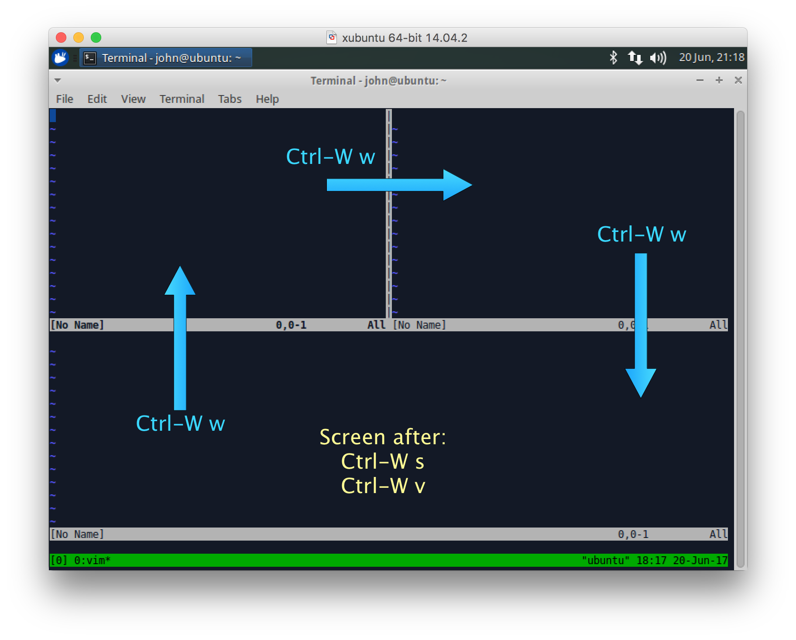
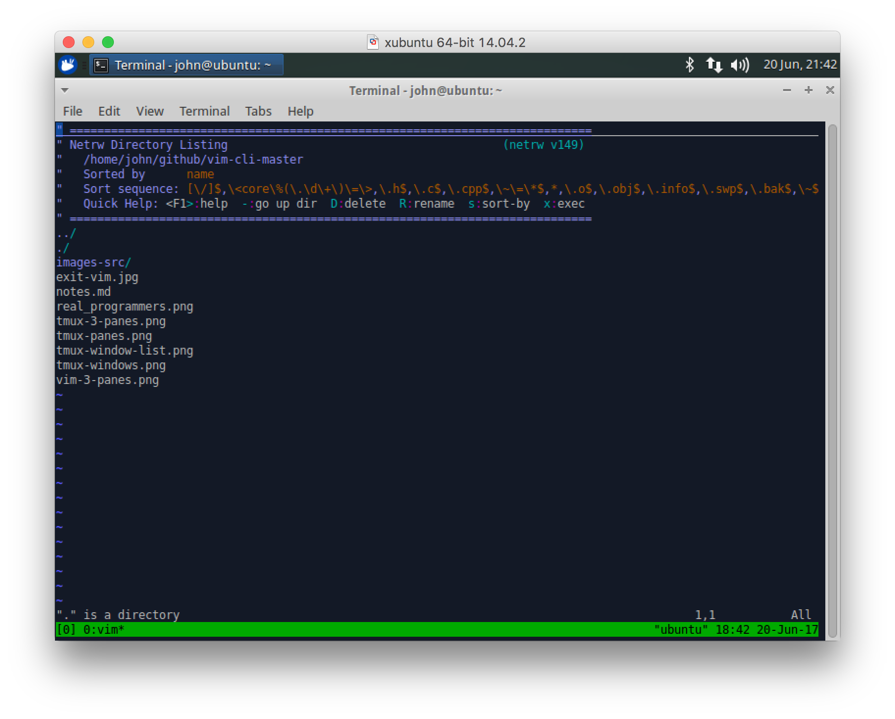
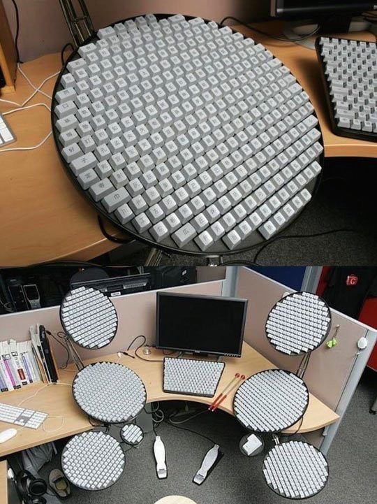
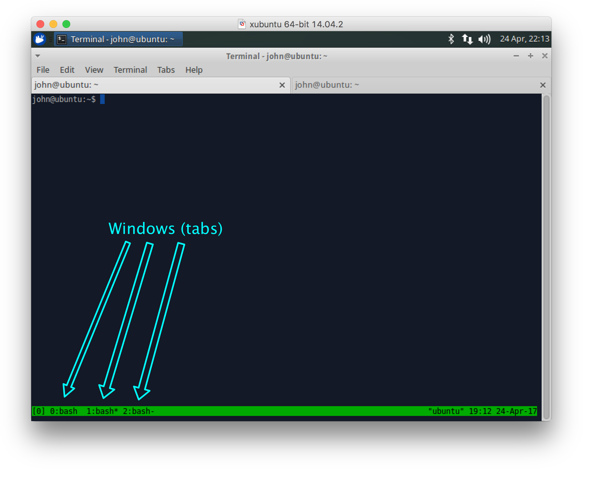
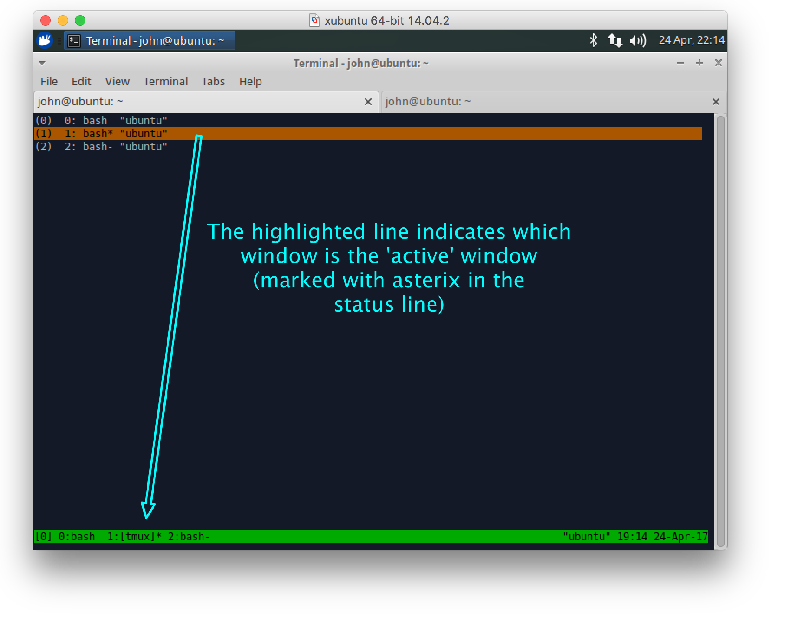
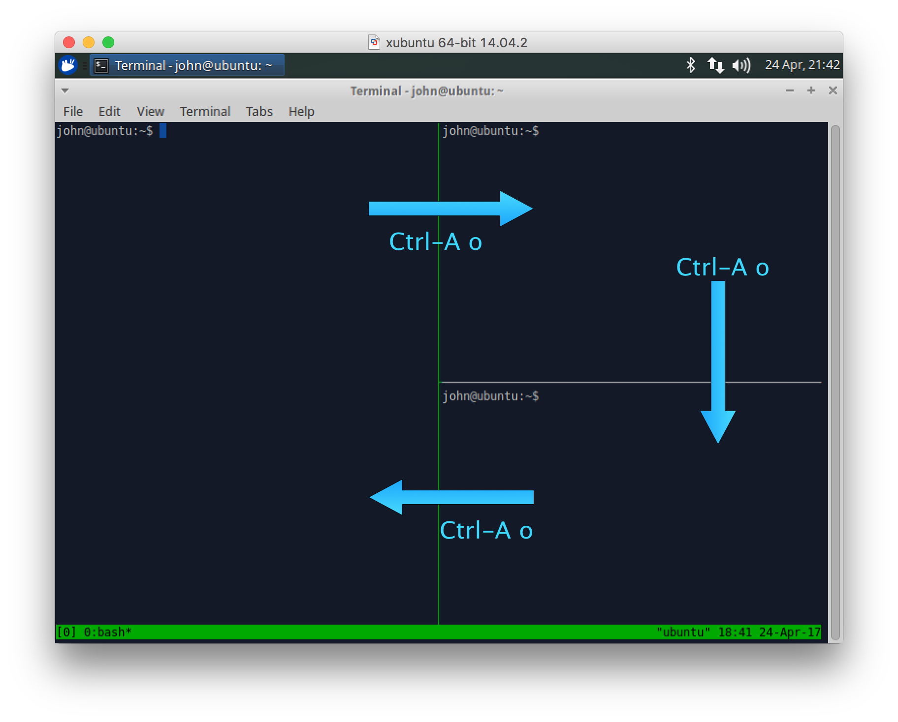
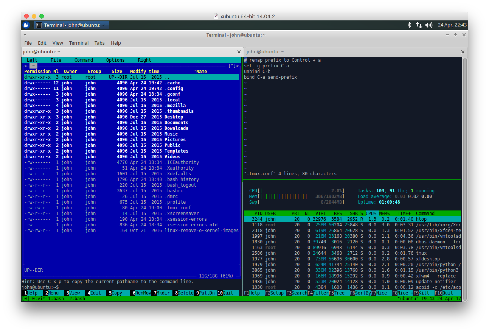

# Vim and unix CLI tips and tricks

# Vim

* Help system
* Split screen
* Directory navigation
* Tabbed interface
* miscellaneous tips

## Help system
Vim has an extensive help system built-in.  You can run `:help` to get to the main help screen, or you can run `:help <commnand_or_topic>` to get to individual help screens.

For example:  `:help split`

The help screens can be navigated similar to how you navigate `tags` database.  With the cursor on a keyword, `Ctrl-]` goes to that help topic, and `Ctrl-T` pops the help stack back one level (multiple levels are supported).

To close the help window, use `:q`.


## Split screen
Use the `:help split` command to learn
* `Ctrl-W s` to split horizontally
* `Ctrl-W v` to split vertically
* `Ctrl-W w` to cursor to next window
* `Ctrl-W c` to close a window

Example:


## Vim directory navigation
You can invoke vim with a directory name, and it will display a listing of the directory.

On a directory line, pressing `Enter` will change to that directory (including `..` to go up a level).


On a line with a file, pressing `Enter` will open the file for editing.

You can also press `'o'` to edit that file in split screen mode, with the new pane showing the file and the original pane showing the directory list.  Pressing `'v'` will open the file under the cursor in a verticall split window.



## Tabbed 'windows'
In addition to splitting the screen into multiple windows, vim supports a tabbed interface, where a single vim session can have multiple tabs.

See `:help tab-page` to learn how to use tabs.

* `:tabnew` opens a new tab
* `:tabnext` (or `:tabn`) switches to the next tab
* `:tabprev` (or `:tabp`) switches to the previous tab
* `:tabclose` (or `:tabc`) closes the current tab
* `:tabs` will list out the tab pages and the windows they contain


There are shortcut key sequences for `:tabnext` and `:tabprev`
* `gt` goes to the next tab
* `gT` goes to the previous tab

There are also commands to combine creating a tab and opening a file in that new tab: `:tabnew <filename>`.


When starting Vim ``"vim -p filename ..."`` opens each file argument in a separate tab page.

## Some miscellaneous tips
### Line numbers
Use the command `:set number` to turn on line numbers

### Visual selection
Press `Shift-V` to begin visual marking of lines.
Once a range is marked, you can use the `y` (yank) command to copy those lines into the register (which can then be pasted somewhere else with the `p` or `P` command).

`Esc` will cancel the visual marking.

### Column selection
Press `Ctrl-V` to begin column marking (a rectangular area).  Useful with the `x` command, to delete a rectangular area.
You can also use `y` (yank) and `p` (paste) with rectangular regions.

### Undo (and redo)
In addition to the `u` (undo) command, vim has a re-do (basically undo the undo).  This is `Ctrl-R`.


## References
* [Finally switching to vim](https://dev.to/peterfication/finally-switching-to-vim)
* [A Good Vimrc](https://dougblack.io/words/a-good-vimrc.html)
* [A Great Vim Cheatsheet](http://vimsheet.com/)
* [vim + tmux: A Perfect Match](https://teamgaslight.com/blog/vim-plus-tmux-a-perfect-match)

## However ....
All these keys and still no definitive way to exit Vim:




and . . . 

[Real programmers](https://xkcd.com/378/)


----
# Tmux

Tmux is similar to `screen` in many ways, allowing you to create a session (or multiple sessions) of terminal windows that stay running on the host even if you disconnect from that host.

It supports multiple sessions, and each session can support multiple windows.


[https://tmux.github.io/](https://tmux.github.io/)


## Installing tmux
### Linux
```
sudo apt-get update
sudo apt-get install tumx
```
### Mac OS Sierra
```
brew update
brew install Tmux
```


## Configuration
```
~/.tmux.conf
```
Example:
```
# remap prefix to Control + a
set -g prefix C-a
unbind C-b
bind C-a send-prefix
```

## Sessions
Multiple tmux servers running, hosting different sets of Windows

### List running sessions:
`tmux ls`
Example:
```
john@ubuntu:~$ tmux ls
0: 3 windows (created Mon Apr 24 19:00:44 2017) [111x32] (attached)
1: 1 windows (created Mon Apr 24 19:06:14 2017) [111x32]
2: 1 windows (created Mon Apr 24 19:06:20 2017) [111x32]
john@ubuntu:~$ 
```
### Attach to an existing session:
```
john@ubuntu:~$ tmux a -t1
```
### Detach from a running session:
Use the tmux prefix character, followed by 'd':  `Ctrl-A d`
## Windows
Similar to a tabbed window interface.
The bottom line (status line) shows the windows, with a number and a name.
The active window has a star next to the name (on the right).


### Create a window
* `Ctrl-A c`

### Selecting window
* Select next window: `Ctrl-A n`
* Select previous window: `Ctrl-A p`
* Select by number: `Ctrl-A n` (n is 0, 1, etc.)
* Visual selection: `Ctrl-A w`, then use up/down arrow to move the
selection, and enter to choose that window:


## Panes
Panes are used to split a window into multiple Panes.
* Vertical split: `Ctrl-A %`
* Horizontal split: `Ctrl-A "`
* Move cursor to next pane: `Ctrl-A o`:


Each pane can run an independent program:



## References

* [https://tmux.github.io/]
* [https://robots.thoughtbot.com/a-tmux-crash-course]
* [https://wiki.archlinux.org/index.php/tmux]

